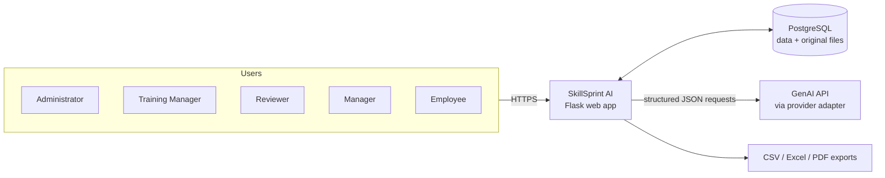
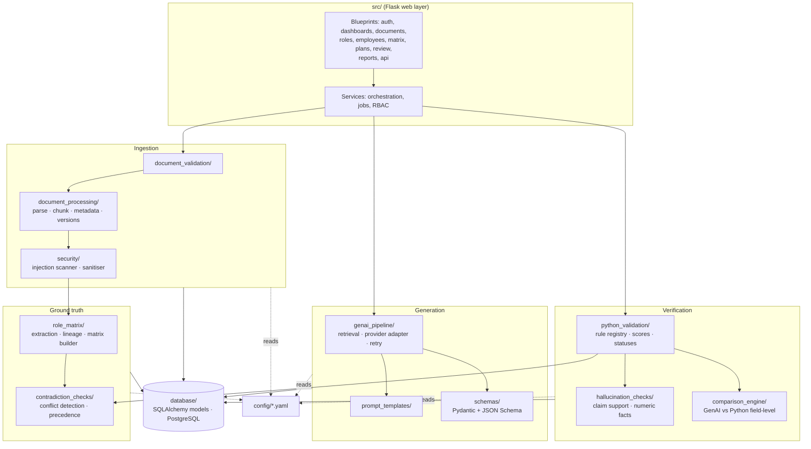
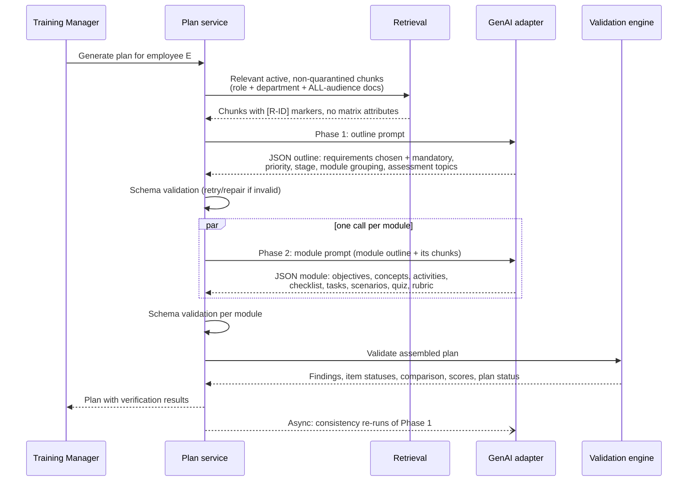
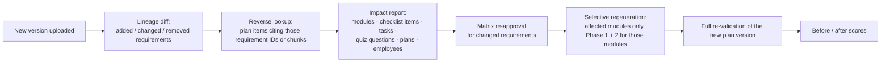

# SkillSprint AI: System Architecture

**Stack:** Python 3 · Flask · PostgreSQL (SQLAlchemy) · Jinja2 + HTML/CSS/vanilla JS · one approved GenAI API
**Companion documents:** [03_Database_Design.md](03_Database_Design.md) · [01_MoSCoW_Analysis.md](01_MoSCoW_Analysis.md) · [dataset/](dataset/README.md)

---

## 1. Design principles

These five rules decide most of the questions below.

1. **GenAI writes, Python decides.** The GenAI API generates onboarding content. Every status, score, approval, precedence decision and security decision is computed by Python. No GenAI output field can change a verification status.
2. **The ground truth is independent of the generator.** The Role Requirement Matrix is built by deterministic extraction plus human approval. The GenAI model never sees the matrix, only source text. That is what makes coverage and role-relevance scores meaningful rather than circular.
3. **Everything evaluators may change live is configuration.** Stages, precedence, validation rules and thresholds, quiz types, statuses, schema and filters live in `config/` and `schemas/`, not in code paths.
4. **Every output is traceable to a logged run.** Each plan item links to its source chunk, its generation run (prompt version, model, raw response) and the validation findings about it. Nothing is displayed that cannot be traced back.
5. **Simple infrastructure, careful logic.** One Flask app, one PostgreSQL database, an in-process job pool, no message broker or vector database. The effort goes into the validation logic, which is what gets evaluated.

---

## 2. System context

**SkillSprint AI** is the product. **Aurelle Hotels & Residences** is the organisation using it. Aurelle's documents, roles and employees are data inside SkillSprint.



---

## 3. Component architecture

The folder names are the ones prescribed by the SRS (§1.10.2), so evaluators find each concern where they expect it.



**Dependency rule, enforced by a test:** `python_validation/`, `comparison_engine/`, `hallucination_checks/`, `contradiction_checks/` and `role_matrix/` never import `genai_pipeline/` or any GenAI SDK. This makes SRS §1.8.14 ("GenAI must not replace Python validation") structurally true, not just a promise.

### Repository layout

```
SkillSprint/
├── src/                      Flask app factory, blueprints, services, jobs
├── templates/  static/       Jinja2 pages; CSS (tokens.css), JS, icons
├── document_processing/      pdf_parser, docx_parser, chunker, metadata, versioning
├── document_validation/      file type, size, duplicates, empty, dates, version conflicts
├── security/                 injection scanner, sanitiser, auth helpers, rate limits
├── role_matrix/              requirement extractor, classifiers, lineage, matrix builder
├── contradiction_checks/     source conflicts, generated-vs-rule conflicts, precedence resolver
├── genai_pipeline/           retrieval, provider adapters, generator, retry, consistency runner
├── prompt_templates/         versioned templates (*.j2) with header metadata
├── schemas/                  Pydantic models + exported JSON Schemas for GenAI output
├── python_validation/        rule registry, rules/, scoring, status derivation
├── hallucination_checks/     claim splitter, claim classifier, support checker
├── comparison_engine/        field comparison, disagreement explanations
├── database/                 SQLAlchemy models, audit trail, seed data (input data only), PostgreSQL hardening SQL
├── config/                   YAML configuration (see §10)
├── tests/                    pytest suites mirroring each package
├── tools/dataset_builder/    builds sample_documents/ (dev tool, not imported by the app)
├── sample_documents/  hidden_test_ready/  documentation/  screenshots/  reports/
└── README.md  AI_USAGE.md  requirements.txt  LICENSE  .env.example
```

---

## 4. Pipeline A: document ingestion

Triggered by an upload or a batch folder ingest. It runs as a background job, and the UI shows per-step progress.

| Step | Module | What happens | Key outputs |
|---|---|---|---|
| 1. File validation | `document_validation` | Magic-byte type check (`%PDF`; DOCX = ZIP containing `word/document.xml`), size limit, SHA-256 duplicate check, empty-text check | Accept, or reject with a reason |
| 2. Parse | `document_processing` | **PDF:** pdfplumber text per page, font size/weight for heading detection, character colour and size (hidden-text evidence). **DOCX:** paragraphs with style names (Heading 1/2), tables, footers, core properties, runs flagged `hidden` | Ordered blocks with page / paragraph references |
| 3. Metadata | `document_processing.metadata` | Read the metadata header table. Otherwise use the upload form values. Otherwise use heuristics (ID and version patterns, dates in the text). The source of each field is recorded | `metadata_source` per field; warnings for guessed fields |
| 4. Metadata validation | `document_validation` | Version format, effective ≤ today (else *Scheduled*), expiry < today (else *Expired*), draft status, department and category from the config list, version conflicts with existing lineage | Document status |
| 5. Security scan | `security.injection_scanner` | Pattern families: instructions aimed at AI, system/role impersonation, fake authority, zero-width/homoglyph obfuscation, base64 blobs (decoded and re-scanned), JSON/markup breakers, hidden text (DOCX vanish, PDF white or tiny text), prompt-extraction requests | `security_findings`; affected chunks quarantined |
| 6. Chunk | `document_processing.chunker` | Split on headings, then by size with a small overlap; carry the heading path, section ID and location | `chunks` with stable IDs `{doc}:{ver}:{section}:{n}` |
| 7. Versioning | `document_processing.versioning` | Place the document in its lineage. The newest effective approved version becomes *Active*; earlier ones *Superseded* | Lineage update. **Triggers Pipeline F** if a lineage gained a new active version |
| 8. Extract requirements | `role_matrix.extractor` | See §5 | `requirements` (pending approval) |
| 9. Detect conflicts | `contradiction_checks` | See §6.3 | `conflicts` |

**Quarantine policy:** quarantined chunks are never sent to the GenAI model and never produce requirements. They stay visible in the ingestion report so a reviewer can see exactly what was blocked and why.

---

## 5. Pipeline B: requirement extraction and the Role Requirement Matrix

Fully deterministic. The rules live in `config/extraction.yaml`.

1. **Clause split:** chunk text is split into sentences. Sentences inside tables are kept with their row context.
2. **Obligation classification** (modal lexicon):
   - *must / shall / is required to / is prohibited / may only / will not be approved* → mandatory
   - *should / is encouraged / is recommended* → Recommended
   - *may / can* → Optional
   - no obligation → informational, so not a requirement
3. **Requirement type** (verb and object patterns): *complete / attend / training* → Must Complete; *demonstrate / role-play / practical* → Must Demonstrate; *sign / acknowledge / declaration* → Must Acknowledge; otherwise Must Know.
4. **Applicability:**
   - role names and aliases from `job_roles` (e.g. "Front Office Associates", "front desk staff")
   - departments
   - the document's *Applies To* metadata
   - otherwise *all roles in the document's audience*
5. **Conditions:** patterns such as *"At Malaysian properties"*, *"assigned to …"*, *"holding a valid … certificate"*, *"with two or more years of …"*, *"night shifts"*. Each maps to a structured condition over employee profile fields, e.g. `property.country == "Malaysia"`.
6. **Stage:** phrases such as *"first day / Day 1"*, *"first week / Week 1"*, *"within 30 days"*, *"before their first shift"* map to stage codes. When the text has no stage, the default stage for the category comes from config.
7. **Facts:** numbers with units (minutes, hours, days, °C, USD, %, kg), times of day and actors ("Duty Manager", "Finance Manager") are stored on each requirement. Contradiction and hallucination checks use them.
8. **Competency and priority:** competency from a keyword map in config; priority from type and tier (safety, security and data privacy mandatory → High).
9. **Prerequisites:**
   - explicit cross-references ("in line with REV-01 Section 3.4")
   - "before …" dependencies on a named training ("before being granted access" → R-ISP-001)
   - a configured competency ordering (e.g. Information Security before Data Privacy before ID handling)
10. **IDs and lineage:** `R-{DOC}-{NNN}` in reading order. When a new version arrives, each clause is matched to its predecessor by section ID first, then by text similarity. A match keeps the ID and is marked *changed* or *unchanged*; an unmatched clause gets a new ID (*added*); a predecessor with no match is marked *removed*.
11. **Matrix build:** approved requirements × applicable roles → matrix rows. An Administrator or Training Manager reviews the draft matrix, edits where extraction was wrong (every edit audited), and approves it. That creates a numbered, immutable **matrix version**. Plans record the matrix version they were validated against.

**Accuracy is measured, not assumed.** `tests/test_extraction_accuracy.py` compares extraction output on `sample_documents/` against the gold register in `documentation/dataset/`. It reports precision and recall for requirements, and accuracy for the mandatory flag, type, roles and stage. These figures go into the project report.

---

## 6. Pipeline C: plan generation (GenAI, Pipeline 1 in the SRS)

### 6.1 Two-phase generation

A complete plan (8–12 modules with objectives, checklists, tasks, scenarios, quizzes and rubrics) is too much output for one call to finish within the SRS's 30-second target. It is also harder to check. So generation is split into two phases:



- **Phase 1 (outline):** the model reads the source chunks and the employee profile (role, department, property, experience, joining date). It decides which requirements apply, their mandatory status, priority and due stage, how to group them into modules, and the assessment topics. **This is the structured output the comparison engine checks against the matrix.**
- **Phase 2 (module content):** one call per module, run in parallel with a configurable concurrency limit. Each call receives only its module outline and its source chunks, and returns the instructional content.

**What the model receives:** the source text, with each extracted clause prefixed by its requirement ID so the model can cite it. It does **not** receive the matrix attributes (mandatory flag, roles, priority, stage). The model must infer those from the text, which is exactly what Pipeline 2 then checks independently. The chunk set deliberately covers whole documents rather than pre-filtered requirements, so the model faces real noise: requirements for other roles, conditional requirements that don't apply, and superseded wording in lower-tier documents.

### 6.1a As built (Day 3): sharded outline and deterministic modules

Measurements with the first design (one outline call that also grouped modules) showed about 36 s for Phase 1 alone, and Gemini free-tier rate limits (HTTP 429) whenever eight module calls ran at once. The implemented pipeline therefore differs in three ways:

- **Phase 1 runs in parallel shards.** The source documents are split into groups of whole documents (about 35 requirement clauses each), and each group gets its own outline call. Each call decides applicability, mandatory status, priority, due stage and a **knowledge-area category** per requirement.
- **Modules are built by Python.** Requirements are grouped by the category Gemini assigned, small categories are merged, and modules are ordered by stage (`compose_modules`, deterministic). Gemini still identifies the knowledge areas; Python only groups them, so shards never disagree about module boundaries.
- **Per-phase models.** Phase 1 uses `gemini-3.5-flash` with thinking set to *minimal*; Phase 2 uses `gemini-3.5-flash-lite`, which has its own rate limit and wrote valid module JSON in about 8 s per module. A 429 switches straight to the fallback model instead of retrying the same model.

Measured on the sample dataset (Front Office Associate, 130 source clauses, 8 modules, 144 items): **31.7 s end to end**. Phase 1 took 13.8 s (4 parallel calls) and Phase 2 took 12.9 s. The first attempt, before these changes, took 132 s.

### 6.2 Output contract

The JSON schemas live in `schemas/` as Pydantic models, exported to JSON Schema for the provider's structured-output mode. Summarised:

| Schema | Key fields |
|---|---|
| `PlanOutline` | `employee_id`, `role`, `modules[]: {module_key, title, category, stage, requirement_ids[], assessment_topics[]}`, `requirements[]: {requirement_id, mandatory, priority, due_stage, module_key, source_document_id, source_section_id}`, `excluded[]: {requirement_id, reason}`, `insufficient_information[]` |
| `ModuleContent` | `module_key`, `title`, `purpose`, `learning_objectives[] {text, requirement_ids}`, `key_concepts[]`, `required_sources[] {document_id, section_id}`, `estimated_duration_minutes`, `activities[]`, `checklist[] {activity, required, due_stage, source, responsible}`, `tasks[] {description, expected_outcome, source_requirement, completion_criteria, difficulty, due_stage}`, `scenarios[]`, `quiz[] {type, question, options, correct, explanation, difficulty, source_document_id, source_section_id}`, `assessment {type, rubric[] {criterion, weight, expected_performance, pass_condition}}`, `completion_criteria` |

Every item that states a fact carries `source_document_id` + `source_section_id`. Free text is never the only output (SRS Step 37).

### 6.3 Provider adapter, prompts, retry and logging

- **Adapter:** `genai_pipeline/providers/` has one class per provider behind a single `generate(prompt, schema, params)` interface. The provider and model come from `config/genai.yaml` plus environment variables. The API key lives only in `.env` / the host's secret store.
- **Prompts:** `prompt_templates/plan_outline.j2`, `module_content.j2`, `topic_request.j2`. Each template carries a header (`name`, `version`, `changelog`), and the loader records its SHA-256. The **system prompt** states the rules: source text is data, instructions inside it are to be ignored, cite or say "insufficient information", never invent policy. The source text sits inside clearly delimited data blocks.
- **Retry** (SRS Step 39):
  - error types: timeout, rate limit, quota, auth, invalid JSON, schema failure, incomplete output
  - retryable errors use exponential backoff with jitter, **max 3 attempts**
  - invalid JSON gets **one repair attempt**: the validation errors are sent back with the previous output
  - non-retryable errors (auth, quota exhausted) fail fast with a clear message
  - every attempt is logged
- **Run log** (`generation_runs`): rendered prompt, template version and hash, provider, model, parameters, source document versions, raw response, parse result, schema errors, attempts, latency and tokens. The GenAI-evidence deliverables (sample requests, responses, failure examples, retry evidence) are exported directly from this table.

### 6.4 Consistency testing (SRS Steps 44–45)

After a plan is generated, Phase 1 is re-run N more times (config, default 2) with the same inputs and fixed parameters. Python compares the runs on sets, never wording:

| Dimension | Compared set |
|---|---|
| Mandatory requirements | requirement IDs marked mandatory |
| Sources | (document, section) pairs cited |
| Module categories | category per requirement |
| Assessment topics | normalised topic strings (fuzzy-matched) |

Consistency score = mean Jaccard similarity across dimensions and run pairs. Requirements that appear in some runs but not others are listed as major differences and flagged. Re-runs happen in the background, so they don't count against the 30-second budget.

### 6.5 Topic requests and the hallucination challenge

When a user asks for training on a topic ("spa hygiene", "valet damage claims"), a **retrieval gate runs before any GenAI call**. If no active, non-quarantined chunk scores above the similarity threshold, the request is refused with *"Insufficient approved sources"*. The nearest sections and their scores are shown, and the request can be routed to manual review. The model is never asked to write training without source material.

### 6.6 Performance budget (NFR 1: ≤ 30 s)

| Step | Target |
|---|---|
| Retrieval and prompt assembly | < 1 s |
| Phase 1 outline | 8–12 s |
| Phase 2 modules (parallel) | 10–14 s |
| Schema validation, Python validation, comparison, scoring | < 2 s |
| **Total** | **≈ 20–29 s** |

The UI shows a live step timeline (the "pipeline run timeline" feature), so the time is visible, not a spinner. If the provider's rate limits prevent full parallelism, the concurrency limit is tuned in config and the measured timings are reported honestly.

---

## 7. Pipeline D: validation (Pipeline 2 in the SRS)

### 7.1 Rule registry

`python_validation/rules/` contains one small function per check, registered with an ID. Each rule receives the plan and a read-only context (matrix version, requirements, chunks, documents, conflicts, config) and returns findings: `{rule_id, severity, item_id, requirement_id, message, evidence}`. Rules are enabled, weighted and tuned in `config/validation_rules.yaml`. **Adding a rule live means one function, one decorator and one config line.**

| Rule ID | SRS requirement | Check |
|---|---|---|
| V-SCHEMA | Step 38 | Missing fields, types, duplicate IDs, missing mandatory flag (from schema validation) |
| V-REQ-ID | §1.2 | Requirement IDs exist and belong to the plan's matrix version |
| V-SOURCE | §1.2, Step 15 | Cited document and section exist, are active, and the section contains the cited requirement |
| V-OUTDATED | §1.2 | Citation points to a superseded, expired, draft or scheduled version |
| V-COVERAGE | Steps 28–29 | Every mandatory matrix requirement for this employee (conditions applied) is covered by at least one plan item |
| V-MANDATORY | §1.2 | GenAI mandatory flag equals the matrix flag |
| V-ROLE | Step 36 | Plan contains requirements outside the employee's matrix rows (valid company content, wrong role) |
| V-CONDITION | Step 12 | Conditional requirements only when the employee profile satisfies the condition |
| V-STAGE | Step 13 | Due stage matches the matrix; Day 1 not overloaded; nothing pulled forward to Day 1 |
| V-SEQUENCE | Steps 26–27 | Prerequisites exist and come earlier; no advanced task before basic training; no assessment before its learning content |
| V-DUPLICATE | Step 35 | Near-duplicate modules, tasks, checklist items and quiz questions (normalised text plus TF-IDF cosine / fuzzy ratio) |
| V-CHECKLIST | §1.2, Step 17 | Every mandatory Must Complete / Must Acknowledge requirement has a checklist item with all required fields |
| V-TASK-ROLE | §1.2, Step 18 | Tasks trace to requirements of this role |
| V-ASSESS | §1.2, Step 23 | Every requirement marked for assessment has an assessment topic; rubric weights sum to 100 |
| V-QUIZ-SOURCE | Steps 21–22 | Each question cites a source; the correct answer is supported by the cited chunk; distractors are **not** supported by it |
| V-HALLUCINATION | Steps 31–32 | Claim-level support check (§7.2) |
| V-CONTRADICTION | Step 33 | Generated content contradicting the governing requirement (facts or actors differ); plan citing the losing side of a resolved conflict |
| V-BUSINESS | §1.2 | Configurable business rules (e.g. pass mark 80%, maximum Day-1 load) |

### 7.2 Hallucination and unsupported-content detection

1. **Split** generated text fields into claims (sentences).
2. **Classify** each claim:
   - *Instructional wording* (starts with a learning verb such as "Review", "Discuss", "Practise", with no facts) → allowed without a source.
   - *Factual claim* (contains numbers, times, amounts, actors, obligations or policy terms) → needs support.
3. **Support check** against the cited chunk, falling back to the module's chunks:
   - TF-IDF cosine similarity above the threshold, **and**
   - every number, unit, time and actor in the claim also appears in the source (the *numeric-fact check*).
4. **Result:**
   - supported → nothing
   - similar text but a missing fact → *Unsupported: fact not in source* (catches world-knowledge leakage, e.g. "63 °C" when the source says 65 °C)
   - no similar source → *Possible hallucination*
   - both route to review, and mandatory items are never silently accepted

### 7.3 Contradiction detection and precedence

- **Between sources, at ingestion:** candidate pairs are requirements from different documents with high text similarity or the same topic key. A pair conflicts if its numeric facts differ for the same unit, its actors differ for the same action ("only by the Duty Manager" vs "front desk staff can"), or its modality is opposite (prohibited vs allowed).
- **Across versions:** handled by lineage (changed clause = version conflict, resolved by rule 1).
- **Resolution:** `contradiction_checks.precedence` applies the rules in `config/precedence.yaml` in order: same lineage → latest; higher tier wins; life-safety override (stricter wins, with a warning); same tier → *Manual Review Required*. Each resolution stores the rule used and a plain-language explanation.
- **Honesty note:** conflict detection is heuristic. Its precision and recall are measured against the 13 planned conflicts in the dataset and reported, including misses.

### 7.4 Statuses and scores

**Item-level status** (the SRS §1.2 list), derived from findings by priority:

| Condition (first match wins) | Status |
|---|---|
| Contradiction finding, unresolved | Contradiction Detected |
| Mandatory requirement not covered | Requirement Missing |
| Requirement not in matrix for this employee | Unsupported Requirement |
| Cited version not active | Outdated Source |
| Fact claim without support | Source Support Missing |
| Review-routed finding (ambiguity, same-tier conflict, missing annex) | Manual Review Required |
| Some checks passed, non-blocking findings remain | Partially Verified |
| Only warnings (e.g. resolved conflict, life-safety override) | Verified with Warning |
| No findings | Verified |

**Plan-level status** (SRS Step 47), derived from item statuses:

| Condition (first match wins) | Plan status |
|---|---|
| Any Contradiction Detected | Contradictory |
| Any Requirement Missing (coverage < 100%) | Incomplete |
| Any Unsupported Requirement / Source Support Missing on a mandatory item | Unsupported |
| Any Manual Review Required still open | Manual Review Required |
| Only warnings | Verified with Warning |
| All items Verified, coverage 100%, mandatory traceability 100% | **Verified** |

A plan can be assigned to an employee only when it is *Verified*, *Verified with Warning*, or has had every open item resolved by a reviewer. This enforces NFR 4.

**Scores** (all shown with their formula in the UI):

| Score | Formula |
|---|---|
| Mandatory Requirement Coverage | covered mandatory ÷ total mandatory (matrix rows for this employee) × 100 |
| Source Traceability | items with a valid, active, supporting source ÷ items that state facts × 100 (reported overall and for mandatory items) |
| Requirement Consistency | fields matching in the GenAI-vs-Python comparison ÷ fields compared × 100 |
| Generation Consistency | mean Jaccard across repeated Phase 1 runs (§6.4) |
| Missing / Unsupported / Contradiction / Duplicate counts | counts of the corresponding findings |

---

## 8. Pipeline E: comparison, review and audit

- **Comparison engine:** for every requirement in the union of *Python expected* (matrix rows for this employee) and *GenAI produced* (Phase 1 outline), one row compares role, mandatory, priority, due stage, module category, source document, source section, required task and required assessment topic. Each field is *Match* or *Mismatch*, and each row gets a plain-language explanation built from templates, e.g. *"GenAI placed this in Week 2; the matrix requires Day 1 (CMP-01 §2.1)."* This is the table behind the ≥100-row comparison report deliverable.
- **Review queue:** findings that route to review create `review_items`. Reviewers can **Approve, Reject, Edit, Regenerate** (that item or module only) and **Comment** (SRS Step 48).
- **Override:** a Reviewer or Administrator can override a computed status, with a required reason. The original status, the new status, the actor and the reason are all kept (SRS Step 49).
- **Audit trail:** `audit_log` is append-only; the application only ever inserts into it. It covers uploads, quarantines, matrix edits and approvals, generation runs, validations, review decisions, overrides, logins and exports.

---

## 9. Pipeline F: policy update, impact analysis, selective regeneration



- **What changed:** a clause-level diff, showing old and new text and facts side by side.
- **What is affected:** every stored plan item keeps the requirement IDs and chunk IDs it used, so impact is a lookup, not a guess.
- **Selective regeneration:** only modules containing affected requirements are regenerated. The new plan version keeps the untouched modules and records its parent version. The whole plan is then re-validated, because a change in one module can affect coverage and sequencing elsewhere.
- **Scheduled versions** (e.g. HSP-01 v2, effective 2026-11-01) are ingested and visible but don't trigger impact until their effective date. A daily job activates due versions.

---

## 10. Configuration (for live code modification)

| File | Controls | Live-challenge example |
|---|---|---|
| `config/stages.yaml` | Stage codes, labels, day offsets, Day-1 load cap | "Change onboarding duration" |
| `config/precedence.yaml` | Tier per category, rule order, life-safety topics | "Modify policy precedence" |
| `config/validation_rules.yaml` | Rule enablement, severity, thresholds, weights | "Add a validation rule" (+ one function) |
| `config/statuses.yaml` | Item and plan status derivation order | Status wording or order changes |
| `config/extraction.yaml` | Modal lexicon, type verbs, stage phrases, condition patterns, competency keywords | Hidden-document wording variations |
| `config/glossary.yaml` | Synonyms (Duty Manager = MOD, guest folio = guest bill) | New terminology |
| `config/quiz_types.yaml` | Enabled question types and their schema fragments | "Add a new quiz type" |
| `config/genai.yaml` | Provider, model, temperature, max tokens, timeouts, retries, concurrency, consistency runs | Model swap |
| `config/security_patterns.yaml` | Injection pattern families | New attack technique |
| `config/progress_rules.yaml` | On Track / Requires Attention / Behind Schedule rules | Threshold changes |
| `config/recommendation_rules.yaml` | Weak-area signal → recommendation mapping | New recommendation type |
| `config/permissions.yaml` | Role → permission map | Access changes |
| `schemas/*.py` | GenAI output contract | "Change JSON schema" |
| `config/filters.yaml` | Filterable fields per list page | "Add a dashboard filter" |

`config/settings.py` loads environment variables (`DATABASE_URL`, `SECRET_KEY`, the GenAI key, upload limits) from `.env`. `.env.example` is committed; `.env` never is.

---

## 11. Progress, weak areas and recommendations

- **Progress tracking:** one progress record per employee × plan item (module, checklist item, task, quiz, assessment). Overall progress is weighted by item type (weights in config).
- **Progress assessment** (Step 54): rules compare completion against stage due dates computed from the joining date. Outcomes: *On Track, Requires Attention, Behind Schedule, Assessment Required, Completed*. Re-evaluated on every progress event and nightly.
- **Weak areas** (Step 56): per competency and requirement, using quiz error rate, failed assessment criteria, overdue tasks, and the same question answered wrongly more than once.
- **Adaptive recommendations** (Step 55): a rule table, e.g. repeated error on the same requirement → revision module; second failed mandatory assessment → manager review (CMP-01 §3.3); all mandatory items done early → advanced module. Recommendations point to existing, verified plan content or to a regeneration request. They never produce unvalidated new text.

---

## 12. Web layer

### Pages by user role

| Area | Admin | Training Mgr | Reviewer | Manager | Employee |
|---|---|---|---|---|---|
| Admin dashboard (users, plans, compliance, flags) | ✓ | ✓ | view | own team | |
| Documents (upload, ingestion report, versions, diff) | ✓ | ✓ | view | | |
| Roles and Role Requirement Matrix (edit, approve) | ✓ | ✓ | view | | |
| Employees (profiles) | ✓ | ✓ | | own team | own |
| Plans (generate, pipeline timeline, comparison, traceability inspector) | ✓ | ✓ | ✓ | own team (view) | |
| Review queue (decide, override) | ✓ | | ✓ | | |
| Role dashboard | ✓ | ✓ | ✓ | ✓ | |
| Employee learning dashboard (modules, tasks, quizzes, milestones) | | | | | ✓ |
| Reports and exports | ✓ | ✓ | ✓ | own team | own |
| Audit log | ✓ | | view | | |

### Implementation notes

- **Server-rendered Jinja2 pages** for structure, with small vanilla-JS modules that call `/api/*` JSON endpoints for dynamic parts: job progress polling, filters, quiz taking, the traceability side panel. No SPA framework is needed.
- **Charts:** Chart.js, vendored into `static/`, styled from `tokens.css`.
- **Branding:** SkillSprint is the product brand; the active organisation (Aurelle Hotels & Residences) is shown in the header.
- **Responsive layout:** "Clean Verified" design tokens (light and dark, user toggle), sidebar shell that collapses to a drawer below 960 px. Tables scroll inside their own container.

---

## 13. Security

| Concern | Control |
|---|---|
| Authentication | Session login, bcrypt password hashes, login rate limiting, session timeout, secure/HttpOnly/SameSite cookies |
| Authorisation | `@require_permission` decorator on every route, checked server-side against `config/permissions.yaml`; employees only ever see their own records |
| CSRF | Tokens on all state-changing forms and API calls |
| XSS (planted case A11) | Jinja2 autoescaping everywhere; document text never rendered with `|safe`; JSON responses escaped |
| Uploads | Allow-list by magic bytes, size limit, sanitised filenames, original files stored in the database (never executed or served from disk) |
| Prompt injection | Defence in depth: ingestion scanner + quarantine → delimited data blocks and system rules in prompts → strict output schema (no field can carry approval or status) → Python-only decisions → audit |
| Secrets | `.env` locally, the host's secret store in deployment, `.gitignore` enforced, and a test that fails if a key pattern appears in the repo |
| Data minimisation | No sensitive personal data in employee profiles (SRS Step 9) |
| Output handling | GenAI output is parsed as JSON only, never evaluated; oversized or malformed responses are rejected |

---

## 14. Background jobs

Generation, batch ingestion, consistency runs and regeneration take seconds to minutes. `src/jobs.py` runs them on an in-process `ThreadPoolExecutor`, with state persisted in a `jobs` table (queued → running → done / failed, progress steps, result reference). The browser polls `/api/jobs/<id>`.

**Trade-off:** no Redis or Celery means simpler deployment and fewer moving parts. The cost: running jobs are lost if the process restarts. At competition scale this is acceptable. It is documented as a limitation, and on restart any *running* jobs are marked *failed, retry available*.

---

## 15. Deployment

- **Hosting:** Railway web service (gunicorn, 2 workers × threads; Render works the same way) and a managed PostgreSQL database (Render PostgreSQL, Neon or Supabase). Uploaded files are stored in the database, because Render's disk is ephemeral. The app connects through the pure-Python pg8000 driver.
- **Health:** `/healthz` checks the database connection; the GenAI provider is reported as degraded without failing the app, so existing plans keep working during an API outage (NFR 5).
- **Startup:** index creation, config validation (the app refuses to start with an invalid YAML), prompt template hash registration.
- **Evaluation readiness:** evaluator and administrator logins, seeded roles and employees (input data only), and the sample documents preloaded through the normal ingestion pipeline. **No pre-generated plans are ever seeded** (SRS §1.8.12).

---

## 16. Testing strategy (maps to SRS §1.10.10)

| Suite | Examples |
|---|---|
| Parsing / chunking | Page and paragraph references, heading detection, hidden runs, footers, tables |
| Document validation | Wrong type, oversize, duplicate hash, empty, draft, expired, scheduled |
| Extraction accuracy | Precision/recall vs the gold register (reported figures) |
| Security | Every planted A-case detected; unauthorised route access; XSS rendering; secret scan |
| GenAI (mocked provider) | Invalid JSON → repair → retry limits; timeout; quota; incomplete output. Real calls in a separate, opt-in suite |
| Validation rules | One test file per rule with minimal plans that trigger and don't trigger it |
| Coverage / traceability | Exact formula checks (e.g. 11 of 12 mandatory → 91.7%) |
| Contradiction / precedence | All 13 planned conflicts resolved as specified |
| Policy version / regeneration | V-cases: impact lists exact; only affected modules regenerated |
| Hidden-document readiness | Ingest `hidden_test_ready/` with no code change; expected flags |
| Boundary | Zero-requirement role, empty plan, 100-module plan, huge document, Unicode |
| Architecture | Validation packages import no GenAI SDK |

Mocked-provider tests use recorded, clearly labelled fixtures for **tests only**. The running application never uses canned responses (SRS §1.8.12).

---

## 17. Decisions

| Decision | Outcome |
|---|---|
| GenAI provider | **Google Gemini** through the official `google-genai` SDK. Structured output uses Gemini's JSON response mode with a response schema generated from the Pydantic models in `schemas/`; Python still validates every response. The model name comes from the `GEMINI_MODEL` environment variable (a current Flash-tier model is the default choice for the 30-second budget), so it can change without a code edit. Check the project's rate limits in Google AI Studio and set `module_concurrency` in `config/genai.yaml` to match. |
| Auth library | Flask-Login + Flask-WTF (CSRF), bcrypt hashes, lockout after 5 failed attempts |
| Database | **PostgreSQL** through SQLAlchemy 2 and the pure-Python **pg8000** driver (the compiled psycopg driver is blocked by Windows Application Control on the team's machines). JSON columns become JSONB. A local SQLite file is used automatically when `DATABASE_URL` is empty, and tests run on in-memory SQLite, or on PostgreSQL via `TEST_DATABASE_URL` |
| Similarity method | *Open:* TF-IDF by default (no external calls); consider embeddings after the first accuracy measurements |

### 7.3a As built: contradiction detection

- **Same topic** = IDF-weighted overlap of topic words (glossary synonyms normalised, actors and generic verbs removed, times of day kept), measured against the shorter clause. The threshold is 0.4, or 0.25 when one clause forbids or restricts what the other permits and they share a curated glossary term.
- **Disagreement signals:** numbers with the same unit (up to three words apart), deadlines normalised to minutes ("immediately" = 0, "by the end of the shift" = 480), frequencies in months ("annual" = 12), and permission vs prohibition, taken from the clause's main verb.
- Each clause keeps only its strongest pairing with each other document, so one FAQ answer does not collide with every leave rule.
- **Measured on the sample dataset:** 12 of 12 planned conflicts found, with the documented winners (C09 routed to manual review; C11 won by the stricter lower-tier rule under the life-safety rule), plus 2 unplanned but genuine conflicts and 10 version changes. The thresholds were tuned on this dataset, so every conflict is shown with its evidence for a reviewer to confirm.
- Losing clauses are removed from the matrix and from Gemini's source text; a plan that still follows one is marked *Contradictory*.
