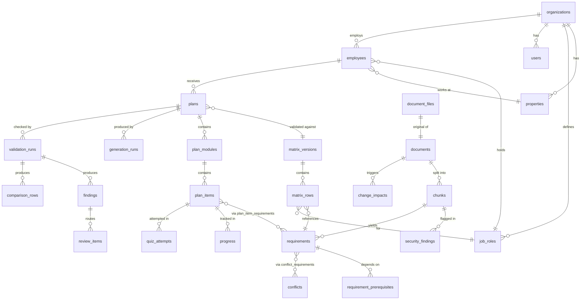

# SkillSprint AI: Database Design (PostgreSQL)

**Database:** PostgreSQL 15+ · **Access:** SQLAlchemy 2 ORM (`database/models.py`) · **Driver:** pg8000 (pure Python)
**Local development and tests:** SQLite through the same models (a file in `instance/`, or in-memory for tests)
**Companion:** [02_Architecture.md](02_Architecture.md)

> The project originally targeted MongoDB and switched to PostgreSQL on Day 1. The data model kept its principles (versioned records, stable business keys, traceability), but it is now expressed as tables with foreign keys and constraints.

---

## 1. Modelling approach

- **Relational where relationships matter.** Requirements, matrix rows, plan items, findings, reviews and progress refer to each other constantly. Foreign keys make those links enforceable, and the key reports become plain SQL joins. Examples: the ≥100-row GenAI-vs-Python comparison, and "which employees are affected by this policy change".
- **JSONB for values that are always read whole.** Parse statistics, metadata-source maps, heading paths, prompts and raw model responses are stored as JSONB (JSON on SQLite). They are never joined on, so turning them into tables would add complexity without benefit.
- **Versioned, never overwritten.** Documents, requirements, matrix versions and plans get a new row per version. Approved rows are not edited in place, which is what makes impact analysis, before/after comparisons and the audit trail possible.
- **Surrogate keys plus business keys.** Every table has an integer `id` primary key for joins. Human-readable keys (`doc_id` + `version`, `req_id`, `employee_code`, `item_key`) are what the UI, the GenAI prompts and the reports use, and each has a unique constraint.
- **Constraints in the database, not only in code.** Enumerations (statuses, roles, experience levels) are `CHECK` constraints, and uniqueness is enforced by unique constraints. The Pydantic models and Python checks come first, but the database refuses invalid data even if a code path forgets.
- **One organisation column where it matters.** SkillSprint is the product and Aurelle is the organisation using it, so organisation-owned tables carry `organization_id`. The competition version runs one organisation; multi-tenancy is out of scope, but the schema doesn't rule it out.

---

## 2. Entity-relationship overview



| Group | Tables | Built |
|---|---|---|
| Organisation & people | `organizations`, `properties`, `job_roles`, `users`, `employees` | ✅ Day 1 |
| Knowledge base | `document_files`, `documents`, `chunks` | ✅ Day 1 |
| Audit | `audit_log` | ✅ Day 1 |
| Security | `security_findings` | Day 2 |
| Ground truth | `requirements`, `requirement_prerequisites`, `conflicts`, `conflict_requirements`, `matrix_versions`, `matrix_rows` | Day 2 |
| Generation | `generation_runs`, `plans`, `plan_modules`, `plan_items`, `plan_item_requirements`, `consistency_checks` | Day 2–3 |
| Verification & control | `validation_runs`, `findings`, `comparison_rows`, `review_items` | Day 3–4 |
| Learning | `progress`, `quiz_attempts`, `recommendations` | Day 4–5 |
| Change management & operations | `change_impacts`, `jobs` | Day 4 |

---

## 3. Organisation and people (built)

### `organizations`
| Column | Type | Constraints / notes |
|---|---|---|
| `id` | serial | PK |
| `org_code` | varchar(40) | unique (`aurelle`) |
| `name` | varchar(200) | |
| `settings` | jsonb | display preferences |

### `properties`
| Column | Type | Constraints / notes |
|---|---|---|
| `id` | serial | PK |
| `organization_id` | int | FK → organizations |
| `code` | varchar(20) | unique with organization (`DXB-HBR`) |
| `name`, `country`, `type` | varchar | `type`: Hotel / Residences / Corporate |
| `services` | jsonb | e.g. `{"in_room_dining": true, "pool": true}`, used by conditional requirements |

### `job_roles`
| Column | Type | Constraints / notes |
|---|---|---|
| `id` | serial | PK |
| `organization_id` | int | FK |
| `code` | varchar(10) | unique with organization (`FOA`) |
| `name`, `department` | varchar | |
| `aliases` | jsonb | ["front desk staff", …], used by requirement extraction |
| `status` | varchar(20) | CHECK `active` / `pending_mapping` (a newly added role awaiting matrix approval) |

### `users`
| Column | Type | Constraints / notes |
|---|---|---|
| `id` | serial | PK |
| `organization_id` | int | FK |
| `email` | varchar(254) | unique |
| `name` | varchar(200) | |
| `password_hash` | varchar(100) | bcrypt; plain passwords are never stored |
| `app_role` | varchar(20) | CHECK `admin` / `training_manager` / `reviewer` / `manager` / `employee` |
| `employee_code` | varchar(20) | indexed; links managers and employees to people records |
| `active`, `failed_logins`, `locked_until`, `last_login_at`, `created_at` | | lockout after 5 failures |

### `employees`
| Column | Type | Constraints / notes |
|---|---|---|
| `id` | serial | PK |
| `organization_id` | int | FK |
| `employee_code` | varchar(20) | unique (`E001`) |
| `name` | varchar(200) | |
| `job_role_id` | int | FK → job_roles, indexed |
| `property_id` | int | FK → properties, indexed |
| `department` | varchar(120) | |
| `experience_level` | varchar(20) | CHECK Beginner / Intermediate / Advanced |
| `experience_years`, `previous_experience` | int, varchar | |
| `joining_date` | date | stage due dates are computed from it |
| `reporting_manager_code` | varchar(20) | indexed (team views) |
| `certifications`, `assignments` | jsonb | e.g. `["hot_work"]`, `["in_room_dining"]`, used by conditions |
| `shift_pattern`, `training_status` | varchar | |

No sensitive personal data (national IDs, salary, health) is stored (SRS Step 9).

---

## 4. Knowledge base (built)

### `document_files`: the original upload
| Column | Type | Constraints / notes |
|---|---|---|
| `id` | serial | PK |
| `filename` | varchar(255) | |
| `sha256` | char(64) | **unique**: duplicate-file detection |
| `size_bytes`, `format` | int, varchar | `pdf` / `docx` |
| `content` | bytea | loaded lazily (deferred column), only when downloaded |

Files live in the database, not on disk, because container disks on the hosting platform are wiped on restart. At the 15 MB upload limit and the NFR scale of 1,000 documents this is comfortably within PostgreSQL's capabilities.

### `documents`: one row per document version
| Column | Type | Constraints / notes |
|---|---|---|
| `id` | serial | PK |
| `doc_id`, `version` | varchar | **unique together**; `doc_id` is the lineage key |
| `title`, `category` | varchar | |
| `tier` | int | precedence tier from `config/precedence.yaml` (0 = never authoritative) |
| `owner_department`, `applies_to_text`, `header_status`, `supersedes_text` | varchar | as read from the document |
| `is_draft` | boolean | |
| `effective_date`, `expiry_date` | date | |
| `status` | varchar(20) | CHECK `pending` / `active` / `superseded` / `scheduled` / `expired` / `draft` |
| `superseded_by` | varchar(20) | version that replaced it |
| `file_id` | int | FK → document_files |
| `metadata_source` | jsonb | per field: `header` / `form` / `heuristic` |
| `parse` | jsonb | pages, words, headings, table rows, hidden blocks, watermark, file properties |
| `warnings` | jsonb | |
| `chunk_count`, `uploaded_by`, `uploaded_at` | | |

Index: `(status, category)` for list filters.

### `chunks`
| Column | Type | Constraints / notes |
|---|---|---|
| `id` | serial | PK |
| `chunk_id` | varchar(120) | **unique**, e.g. `GDP-01:2.0:4.2:1` |
| `document_id` | int | FK → documents, `ON DELETE CASCADE` |
| `doc_id`, `version` | varchar | denormalised for traceability queries |
| `section_id`, `heading` | varchar | `4.2`, `Q12`, `Clause 7`, `para 2`, `footer` |
| `heading_path` | jsonb | `["4. Identity documents", "4.2 Retention"]` |
| `text` | text | normalised (zero-width characters removed) |
| `raw_text` | text | exactly as parsed, kept as evidence |
| `location` | jsonb | `{"page_start": 3, "page_end": 3}` / `{"paragraph_start": 41, …}` / `{"footer": true}` |
| `position`, `word_count` | int | reading order |
| `hidden_content`, `hidden_text` | boolean, text | vanish-formatted or white/tiny text |
| `quarantined` | boolean | excluded from generation and extraction (set by the security scanner) |
| `doc_status` | varchar(20) | copy of the document status, for fast source filtering |

Indexes: `(doc_id, version, position)`; `(doc_status, quarantined)`. The second one serves the retrieval query "active, non-quarantined chunks".

### `audit_log` (built)
| Column | Type | Constraints / notes |
|---|---|---|
| `id` | bigserial | PK |
| `ts` | timestamp (UTC) | indexed |
| `actor` | jsonb | `{user_id, email, app_role}` or `system` |
| `action` | varchar(80) | `document.ingested`, `user.login_failed`, `matrix.approved`, `review.overridden`, … |
| `entity_type`, `entity_id`, `entity_version` | varchar | index `(entity_type, entity_id, ts)` |
| `before`, `after` | jsonb | both kept for edits and overrides (SRS Step 49) |
| `reason` | text | required for overrides |
| `detail` | jsonb | |

**Append-only, enforced twice:** the ORM raises an error on any update or delete of an audit row, and in production `database/postgres_hardening.sql` revokes `UPDATE`, `DELETE` and `TRUNCATE` on this table from the application's database role.

---

## 5. Security and ground truth (Day 2)

### `security_findings`
`id` PK · `chunk_id` FK → chunks · `document_id` FK · `technique` (CHECK: `direct_instruction`, `hidden_text`, `fake_authority`, `obfuscation`, `system_impersonation`, `malicious_requirement`, `draft_document`, `irrelevant`, `structure_injection`, `encoded_instruction`, `markup_injection`, `prompt_extraction`) · `pattern_id` · `severity` · `excerpt` · `decoded` (for base64 / zero-width cases) · `action` (`quarantined` / `flagged` / `document_rejected`) · `reviewed_by`, `review_note`, `created_at`.

### `requirements`: one row per requirement **per document version**
| Column | Type | Constraints / notes |
|---|---|---|
| `id` | serial | PK |
| `req_id` | varchar(30) | `R-GDP-004`, stable across versions through lineage; **unique with `document_id`** |
| `document_id`, `chunk_id` | int | FKs |
| `section_id` | varchar | |
| `text` | text | the clause, verbatim |
| `req_type` | varchar | CHECK Must Know / Must Complete / Must Demonstrate / Must Acknowledge / Recommended / Optional / Not Applicable |
| `mandatory` | boolean | |
| `modality`, `priority`, `due_stage`, `competency`, `assessment_type` | varchar | |
| `roles` | jsonb | role codes or `["ALL"]` |
| `condition` | jsonb | `{"field": "property.country", "op": "eq", "value": "Malaysia", "text": "…"}` |
| `facts` | jsonb | numbers, times, actors extracted from the clause (used by contradiction and hallucination checks) |
| `cross_refs` | jsonb | `[{doc_id, section_id, resolved}]`; unresolved = broken reference |
| `status` | varchar | CHECK `pending_approval` / `approved` / `superseded` / `outdated` / `excluded` |
| `lineage_change` | varchar | `unchanged` / `changed` / `added` / `removed` compared with the previous version |
| `previous_requirement_id` | int | self-FK: the same requirement in the previous document version |
| `extraction` | jsonb | rules fired, confidence, reviewer edits |
| `approved_by`, `approved_at` | | |

### `requirement_prerequisites`
`requirement_id` FK, `prerequisite_id` FK, `source` (`cross_reference` / `before_clause` / `competency_order`). PK is the pair. It stays a real table so sequence validation can use a recursive query, and a cycle check runs on insert.

### `conflicts` and `conflict_requirements`
`conflicts`: `id`, `conflict_code` unique (`CF-0007`), `kind` (CHECK `version` / `cross_document` / `generated_vs_rule`), `difference` jsonb (`{"type": "fact", "unit": "days", "left": 5, "right": 10}`), `rule_applied` (`same_lineage` / `tier` / `life_safety` / `same_tier_manual`), `winner_requirement_id` FK, `explanation` text, `status` (CHECK `auto_resolved` / `manual_review` / `resolved_by_reviewer` / `overridden`).
`conflict_requirements`: (`conflict_id`, `requirement_id`) PK, linking the two or more requirements involved.

### `matrix_versions`
`id`, `version_no` int unique, `status` (CHECK `draft` / `approved` / `retired`), `source_documents` jsonb (snapshot of the active document versions used), `stats` jsonb, `created_at`, `approved_by`, `approved_at`, `notes`.

### `matrix_rows`: the Role Requirement Matrix (SRS Step 10)
| Column | Type | Constraints / notes |
|---|---|---|
| `id` | serial | PK |
| `matrix_version_id`, `job_role_id`, `requirement_id` | int | FKs; **unique together** |
| `policy_requirement` / `process_requirement` | text | requirement text split by source category |
| `competency`, `mandatory`, `priority`, `due_stage` | | |
| `source_doc_id`, `source_section_id`, `source_location` | | page or paragraph |
| `assessment_requirement` | varchar | Quiz / Practical / Scenario / Acknowledgement / Checklist / None |
| `condition` | jsonb | copied from the requirement |
| `conflict_id` | int | FK, set when the row exists because it won a conflict |

Index `(matrix_version_id, job_role_id)`. Approved matrix versions are immutable, and a new approval creates a new version.

---

## 6. Generation (Days 2–3)

### `generation_runs`: one row per Gemini call
`id` · `run_code` unique · `plan_id` FK (nullable for topic requests) · `phase` (CHECK `outline` / `module` / `consistency` / `regeneration` / `topic_request`) · `module_key` · `provider`, `model` · `params` jsonb (temperature, max tokens) · `prompt_template`, `prompt_version`, `prompt_sha256` · `rendered_prompt` text · `input_chunk_ids` jsonb · `source_versions` jsonb (SRS Step 41) · `raw_response` text (kept verbatim as evidence) · `parsed_ok` boolean · `schema_errors` jsonb · `attempts` jsonb (`[{n, error_type, message, latency_ms, repaired}]`) · `latency_ms` · `tokens_in`, `tokens_out` · `created_at`.

### `plans`: one row per plan **version**
`id` · `plan_code` + `version` unique · `parent_plan_id` self-FK (selective regeneration) · `employee_id` FK · `job_role_id` FK · `matrix_version_id` FK · `status` (CHECK: the SRS Step 47 plan statuses plus `draft`, `assigned`, `superseded`) · `score_coverage`, `score_traceability`, `score_traceability_mandatory`, `score_requirement_consistency`, `score_generation_consistency` numeric(5,2) · `count_missing`, `count_unsupported`, `count_contradictions`, `count_duplicates` int · `outline` jsonb (the parsed Phase-1 output) · `timeline` jsonb (step timings for the run-timeline UI) · `approved_by`, `approved_at`, `assigned_at`, `created_at`.

Scores are real columns, not JSON, because dashboards filter and sort on them ("plans below 100% coverage").

### `plan_modules`
`id` · `plan_id` FK (cascade) · `module_key` (`M03`, unique within the plan) · `title`, `purpose`, `category`, `stage` · `estimated_minutes` · `key_concepts`, `required_sources`, `activities` jsonb · `completion_criteria` text · `run_id` FK → generation_runs · `position`.

### `plan_items`: everything a learner does or sees, one row each
| Column | Type | Constraints / notes |
|---|---|---|
| `id` | serial | PK |
| `module_id` | int | FK → plan_modules (cascade) |
| `item_key` | varchar | stable ID, e.g. `P12.M03.Q01`; **unique** |
| `item_type` | varchar | CHECK `objective` / `checklist` / `task` / `scenario` / `quiz_question` / `assessment` |
| `stage`, `difficulty` | varchar | |
| `source_doc_id`, `source_section_id` | varchar | citation as generated |
| `content` | jsonb | the type-specific body: question, options, correct answer and explanation; or task description, expected outcome and completion criteria; or rubric rows |
| `status` | varchar | item-level verification status (SRS §1.2 list) |
| `position` | int | |

### `plan_item_requirements`
(`plan_item_id`, `requirement_id`) PK. This is the table that makes **impact analysis a query**: "which items, modules, plans and employees cite a requirement that just changed?"

### `consistency_checks`
`id` · `plan_id` FK · `run_ids` jsonb · `dim_mandatory`, `dim_sources`, `dim_categories`, `dim_assessment_topics`, `score` numeric · `differences` jsonb.

---

## 7. Verification and control (Days 3–4)

### `validation_runs`
`id` · `plan_id` FK · `matrix_version_id` FK · `ruleset_hash` (hash of `validation_rules.yaml` + rule code version) · `plan_status` · score columns (as on `plans`) · `duration_ms` · `created_at`. Validation history is kept, so re-validating never overwrites an earlier result.

### `findings`
`id` · `validation_run_id` FK (cascade) · `rule_id` (`V-COVERAGE`, `V-HALLUCINATION`, …) · `severity` (CHECK `info` / `warning` / `error`) · `plan_item_id` FK (nullable) · `requirement_id` FK (nullable) · `message` text · `evidence` jsonb (`{"chunk_id": …, "similarity": 0.41, "missing_facts": ["63 °C"]}`).
Index `(validation_run_id, rule_id)`.

### `comparison_rows`: GenAI vs Python (SRS Step 46, report deliverable 6)
`id` · `validation_run_id` FK · `requirement_id` FK · `job_role_id` FK · for each compared field (mandatory, priority, due stage, module category, source document, source section, task, assessment topic): `python_<field>`, `genai_<field>`, `match_<field>` · `overall_match` boolean · `coverage_status`, `traceability_status`, `validation_status` · `explanation` text.

Stored as flat columns so the ≥100-row comparison report is a single `SELECT` and a CSV/Excel export.

### `review_items`
`id` · `target_type` (CHECK `plan_item` / `requirement` / `conflict` / `document` / `security_finding`) · `target_id` · `finding_id` FK (nullable) · `summary` · `status` (CHECK `open` / `approved` / `rejected` / `edited` / `regenerated` / `overridden`) · `assigned_to` FK → users · `comments` jsonb · `decision_action`, `decision_by`, `decision_at`, `decision_reason` · `original_status`, `new_status` · `edit_diff` jsonb · `regeneration_run_id` FK.

---

## 8. Learning (Days 4–5)

### `progress`
`id` · `employee_id` FK · `plan_item_id` FK · **unique (employee_id, plan_item_id)** · `status` (CHECK `not_started` / `in_progress` / `completed` / `failed` / `waived`) · `score` · `attempts` · `due_date` · `completed_at` · `verified_by` (manager sign-off for practical tasks).
When selective regeneration creates a new plan version, progress on unchanged items is copied forward. Progress on changed items resets and is flagged "content updated".

### `quiz_attempts`
`id` · `employee_id` FK · `plan_item_id` FK (the quiz) · `attempt_no` · **unique (employee_id, plan_item_id, attempt_no)** · `answers` jsonb (`[{question_item_key, selected, correct, requirement_id, competency}]`) · `score` · `passed` (pass mark from config; CMP-01 §3.1 says 80%) · `started_at`, `submitted_at`.

### `recommendations`
`id` · `employee_id` FK · `plan_id` FK · `type` (CHECK `revision_module` / `additional_quiz` / `additional_task` / `advanced_module` / `manager_review`) · `signals` jsonb · `target_item_id` FK (nullable) · `rule_id` · `status` (`open` / `accepted` / `dismissed` / `done`) · `created_at`.

---

## 9. Change management and operations

### `change_impacts`
`id` · `doc_id`, `from_version`, `to_version` · `changes` jsonb (`[{req_id, change, old_text, new_text, fact_diff}]`) · `affected_counts` jsonb · `matrix_version_after_id` FK · `regeneration_status` · `created_by`, `created_at`.
The affected-item list itself is not stored as JSON. It is computed from `plan_item_requirements` when the page loads, so it is always current.

### `jobs`
`id` · `job_code` unique · `type` (`ingest`, `batch_ingest`, `generate_plan`, `consistency`, `regenerate`, `report`) · `status` (CHECK `queued` / `running` / `done` / `failed`) · `steps` jsonb · `result_ref` · `error` · `created_by`, `created_at`, `updated_at`. Index `(status, created_at)`, used by polling and restart recovery.

---

## 10. Example queries the schema is designed for

```sql
-- Impact analysis: plans and employees affected by requirements that changed in GDP-01 v3
SELECT DISTINCT p.plan_code, e.employee_code, e.name
FROM requirements r
JOIN plan_item_requirements pir ON pir.requirement_id = r.previous_requirement_id
JOIN plan_items pi  ON pi.id = pir.plan_item_id
JOIN plan_modules m ON m.id = pi.module_id
JOIN plans p        ON p.id = m.plan_id AND p.status <> 'superseded'
JOIN employees e    ON e.id = p.employee_id
JOIN documents d    ON d.id = r.document_id
WHERE d.doc_id = 'GDP-01' AND d.version = '3.0' AND r.lineage_change IN ('changed', 'removed');

-- Source retrieval for generation: active, non-quarantined chunks of the documents relevant to a role
SELECT c.chunk_id, c.section_id, c.text
FROM chunks c JOIN documents d ON d.id = c.document_id
WHERE c.doc_status = 'active' AND NOT c.quarantined AND d.tier > 0
ORDER BY c.doc_id, c.position;

-- Comparison report deliverable (>= 100 rows)
SELECT r.req_id, jr.code AS role, cr.python_mandatory, cr.genai_mandatory, cr.overall_match, cr.explanation
FROM comparison_rows cr
JOIN requirements r ON r.id = cr.requirement_id
JOIN job_roles jr ON jr.id = cr.job_role_id
WHERE cr.validation_run_id IN (SELECT MAX(id) FROM validation_runs GROUP BY plan_id);
```

---

## 11. Scale check (NFR 2)

| Target | Estimate | Comfortable? |
|---|---|---|
| 1,000 organisational documents | ~1,300 document rows, ~20k chunk rows, ~8k requirement rows, file content ~1–3 GB at typical sizes | Yes. Indexed lookups; file content is deferred and never scanned |
| 100 job roles | ~8k matrix rows per matrix version | Yes |
| 1,000 employee profiles | ~3k plan versions × ~120 items ≈ 360k plan-item rows; ~150k progress rows | Yes for PostgreSQL with the listed indexes |

The main growth is `generation_runs` (raw prompts and responses). A retention setting keeps the latest N runs per plan, plus every run referenced by a report.

---

## 12. Seed data vs generated data

| Seeded (input data, allowed) | Never seeded (must be generated live) |
|---|---|
| Organisation, properties, job roles, user accounts, employee profiles (`database/seed/aurelle_seed.json`) | Plans, modules, items, quizzes, scores |
| Sample documents, ingested through the normal pipeline | Requirements and matrix: extracted by the pipeline, then approved in the UI |
| Configuration files, prompt templates | Validation runs, findings, comparison rows, consistency scores |

This split is the practical answer to SRS §1.8.12 (no hard-coded plans, answers, scores or comparisons).

---

## 13. Migrations

Tables are created from the models at startup (`db.create_all()`), which suits a five-day build with a single schema owner. Once the schema stabilises and a production database holds data worth keeping, the plan is to adopt Alembic (Flask-Migrate) migrations, so schema changes during evaluation are versioned and reversible.
